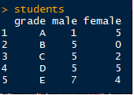

# Tidying-data

## 1. Column headers that are values

| The first problem is when you have column headers that are values, not variable names. I've
| created a simple dataset called 'students' that demonstrates this scenario. Type students to
| take a look.

| The first column represents each of five possible grades that students could receive for a
| particular class. The second and third columns give the number of male and female students,
| respectively, that received each grade.

| This dataset actually has three variables: grade, sex, and count. The first variable, grade, is
| already a column, so that should remain as it is. The second variable, sex, is captured by the
| second and third column headings. The third variable, count, is the number of students for each
| combination of grade and sex.

| To tidy the students data, we need to have one column for each of these three variables. We'll
| use the gather() function from tidyr to accomplish this. Pull up the documentation for this
| function with ?gather.

| Each row of the data now represents exactly one observation, characterized by a unique
| combination of the grade and sex variables. Each of our variables (grade, sex, and count)
| occupies exactly one column. That's tidy data!

| It's important to understand what each argument to gather() means. The data argument, students,
| gives the name of the original dataset. The key and value arguments -- sex and count,
| respectively -- give the column names for our tidy dataset. The final argument, -grade, says
| that we want to gather all columns EXCEPT the grade column (since grade is already a proper
| column variable.)

## 2. Multiple variables in one column

| The second messy data case we'll look at is when multiple variables are stored in one column.
| Type students2 to see an example of this.

| This dataset is similar to the first, except now there are two separate classes, 1 and 2, and
| we have total counts for each sex within each class. students2 suffers from the same messy data
| problem of having column headers that are values (male_1, female_1, etc.) and not variable
| names (sex, class, and count).

| However, it also has multiple variables stored in each column (sex and class), which is another
| common symptom of messy data. Tidying this dataset will be a two step process.

| Let's start by using gather() to stack the columns of students2, like we just did with
| students. This time, name the 'key' column sex_class and the 'value' column count. Save the
| result to a new variable called res. Consult ?gather again if you need help.

| That got us half way to tidy data, but we still have two different variables, sex and class,
| stored together in the sex_class column. tidyr offers a convenient separate() function for the
| purpose of separating one column into multiple columns. Pull up the help file for separate()
| now.

| Conveniently, separate() was able to figure out on its own how to separate the sex_class
| column. Unless you request otherwise with the 'sep' argument, it splits on non-alphanumeric
| values. In other words, it assumes that the values are separated by something other than a
| letter or number (in this case, an underscore.)

| Tidying students2 required both gather() and separate(), causing us to save an intermediate
| result (res). However, just like with dplyr, you can use the %>% operator to chain multiple
| function calls together.

## 3.Variables stored in rows and columns

| A third symptom of messy data is when variables are stored in both rows and columns. students3
| provides an example of this. Print students3 to the console.

| In students3, we have midterm and final exam grades for five students, each of whom were
| enrolled in exactly two of five possible classes.

| The first variable, name, is already a column and should remain as it is. The headers of the
| last five columns, class1 through class5, are all different values of what should be a class
| variable. The values in the test column, midterm and final, should each be its own variable
| containing the respective grades for each student.

| This will require multiple steps, which we will build up gradually using %>%. Edit the R
| script, save it, then type submit() when you are ready. Type reset() to reset the script to its
| original state.

| The next step will require the use of spread(). Pull up the documentation for spread() now

| readr is required for certain data manipulations, such as `parse_number(), which will be used
| in the next question.  Let's, (re)load the package with library(readr).

| Lastly, we want the values in the class column to simply be 1, 2, ..., 5 and not class1,
| class2, ..., class5. We can use the parse_number() function from readr to accomplish this. To
| see how it works, try parse_number("class5").

| Now, the final step. Edit the R script, then save it and type submit() when you are ready. Type
| reset() to reset the script to its original state.

## 4.Multiple observational units in the same table

| The fourth messy data problem we'll look at occurs when multiple observational units are stored
| in the same table. students4 presents an example of this. Take a look at the data now.

| students4 is almost the same as our tidy version of students3. The only difference is that
| students4 provides a unique id for each student, as well as his or her sex (M = male; F =
| female)

| At first glance, there doesn't seem to be much of a problem with students4. All columns are
| variables and all rows are observations. However, notice that each id, name, and sex is
| repeated twice, which seems quite redundant. This is a hint that our data contains multiple
| observational units in a single table.

| Notice anything strange about student_info? It contains five duplicate rows! See the script for
| directions on how to fix this. Save the script and type submit() when you are ready, or type
| reset() to reset the script to its original state.

Student_info table:

| Now, using the script I just opened for you, create a second table called gradebook using the
| id, class, midterm, and final columns (in that order)

Gradebook table:

| It's important to note that we left the id column in both tables. In the world of relational
| databases, 'id' is called our 'primary key' since it allows us to connect each student listed
| in student_info with their grades listed in gradebook. Without a unique identifier, we might
| not know how the tables are related. (In this case, we could have also used the name variable,
| since each student happens to have a unique name.)

## 5.Single observational unit in multiple tables

| The fifth and final messy data scenario that we'll address is when a single observational unit
| is stored in multiple tables. It's the opposite of the fourth problem.

| To illustrate this, we've created two datasets, passed and failed. Take a look at passed now.

| Now view the contents of failed.

| Teachers decided to only take into consideration final exam grades in determining whether
| students passed or failed each class. As you may have inferred from the data, students passed a
| class if they received a final exam grade of A or B and failed otherwise.

| The name of each dataset actually represents the value of a new variable that we will call
| 'status'. Before joining the two tables together, we'll add a new column to each containing
| this information so that it's not lost when we put everything together.

| Use dplyr's mutate() to add a new column to the passed table. The column should be called
| status and the value, "passed" (a character string), should be the same for all students.
| 'Overwrite' the current version of passed with the new one.

| Now, do the same for the failed table, except the status column should have the value "failed"
| for all students.

| Now, pass as arguments the passed and failed tables (in order) to the dplyr function
| bind_rows(), which will join them together into a single unit. Check ?bind_rows if you need
| help.
| 
| Note: bind_rows() is only available in dplyr 0.4.0 or later. If you have an older version of
| dplyr, please quit the lesson, update dplyr, then restart the lesson where you left off. If
| you're not sure what version of dplyr you have, type packageVersion('dplyr').

| Of course, we could arrange the rows however we wish at this point, but the important thing is
| that each row is an observation, each column is a variable, and the table contains a single
| observational unit. Thus, the data are tidy.

## Final example

